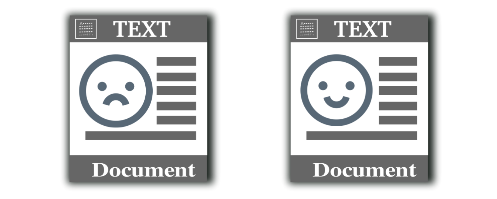

# Project: Optical character recognition (OCR) 



### [Click to get access to the report](https://github.com/stella-chen28/My-repository/blob/master/Optical%20character%20recognition%20(OCR)%20with%20R/proj4_report.pdf)

Term: Fall 2018

+ Project summary: Created an OCR post-processing procedure to enhance Tesseract OCR output.<br/> 
      + Step 1: Learned from the assigned paper D2 and C2, for the detection algorithm and correction algorithm separately.<br/> 
      + Step 2: For D2, the detection part, 2-gram was adopted to detect the word errors. Figured out the former 4 words and the latter 4 words of the detected word. <br/> 
      + Step 3: For C2, at first found correction candidates by Damerau Levenshtein distance ascendingly. Then six functions were defined to calculate the feature scores for each candidate correction words. <br/> 
      + Step 4: Applied AdaBoost model to regress the labels on the six feature scores. The candidate correction word with highest probability will be chosen to replace the wrong word. <br/> 
      + Step 5: Evaluation -- the word-wise evaluation and character-wise evaluation. After post-processing, the recall and precision increases a lot especially in word level. 
	
## [Project description with more detail](doc/project4_desc.md)

Following [suggestions](http://nicercode.github.io/blog/2013-04-05-projects/) by [RICH FITZJOHN](http://nicercode.github.io/about/#Team) (@richfitz). This folder is orgarnized as follows.

```
proj/
├── lib/
├── data/
├── doc/
├── figs/
└── output/
```

Please see each subfolder for a README file.
