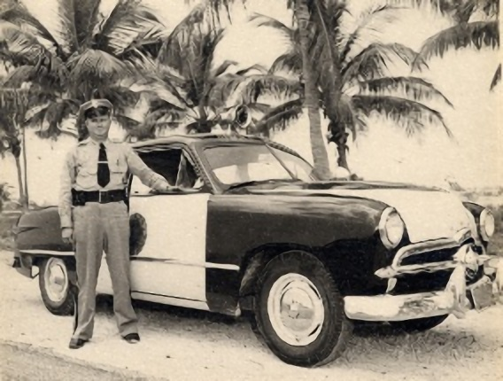

# Project: Can you unscramble a blurry image? 
  

### [Full Project Description](doc/project3_desc.md)

Term: Fall 2018

+ Team #5
+ Team members
	+ Sizhu Chen     sc4248
	+ Binglun Zhao   bz2342
	+ Hengyang Lin   hl3116
	+ Yang Yue       yy2826
	+ Bailey Pierson bp2471

+ Project summary: In this project, we created a classification engine for enhance the resolution of images. 
	
**Contribution statement**: All team members approve our work presented in this GitHub repository including this contributions statement. 

+ Sizhu Chen: feature and superResolution coding, baseline model (GBM) tuning, presentation slides designing
+ Binglun Zhao: train and cross-validation efficiency improving, baseline model (GBM) tuning
+ Hengyang Lin: Keypoints feature extraction, XGBoost implementation(Model selection using CrossValidation, SuperResolution), PSNR evalutaion, presentation.
+ Yang Yue: SRCNN(Super Resolution CNN) implementation.
+ Bailey Pierson: MSE and PSNR coding, Random Forest attempt

Following [suggestions](http://nicercode.github.io/blog/2013-04-05-projects/) by [RICH FITZJOHN](http://nicercode.github.io/about/#Team) (@richfitz). This folder is orgarnized as follows.

```
proj/
├── lib/
├── data/
├── doc/
├── figs/
└── output/
```

Please see each subfolder for a README file.
