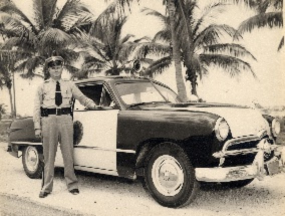

# Super Resolution CNN
-
Tensorflow implementation of Convolutional Neural Networks for super-resolution. 

## Prerequisites

* tensorflow > 1.4.0
* h5py
* keras
* opencv-python

## Usage

#### Test new pictures
1. Run `Predict Test` in `model.ipynb` to enhance the picture.
2. pretrained model is called `SRCNN_check.h5`

#### Reproduce

1. Put `train_set` into `Data` folder
2. Please run `prepare_data.ipynb` first, and produce `crop_train.h5` file which is around 8.5 GB.
3. Run the `model.ipynb` to train the model.
4. `SRCNN_check.h5` will be the pretrained model.

* For training, using GPU is required since its deep learning because CPU training will take around 3.5 days.
* CUDA Tollkit > 8.0
* CUDNN v6.0 (April 27, 2017) for CUDA 8.0

## Results
* Results are in `./output/` folder

* `hr.jpg` is the original HR image
* `resized.jpg` is the LR image but resized to the same size as HR image
* `test.jpg` is the result after super resolution.

