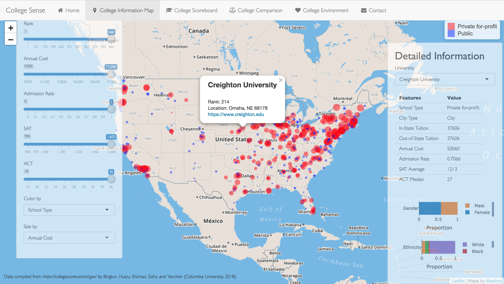

# Project: Shiny App Development Version 2.0

## Project Title: College Sense




Term: Fall 2018

+ **APP Entry**:  [College Sense](https://bz2342.shinyapps.io/fall2018-sec1-proj2-grp6/)

+ **Project Summary**: 
College selection is always a big struggle to most of high school students. Based on this concern, our team designed a user-friendly ShinyAPP to help those with various information of US colleges from different angles. <br/>
We collected as much data as possible, and established four interactive and well-visualized funtioning pages: College infomation Map, College Comprison, Living Quality Summary and College Scoreboard.<br/>
We believe our APP will definitely provide graduating high school students with useful information to make optimal choices.


+ **Data Source**:
   - https://collegescorecard.ed.gov/data/
   - https://www.ers.usda.gov
   - https://wonder.cdc.gov/NASA-NLDAS.html
   - https://www.bls.gov/lau/
   - https://www.census.gov/did/www/saipe/
   - https://wonder.cdc.gov/wonder
   - https://www.forbes.com/sites/nataliesportelli/2016/07/06/the-full-list-of-americas-top-colleges-2016/#191c50d569a4


Following [suggestions](http://nicercode.github.io/blog/2013-04-05-projects/) by [RICH FITZJOHN](http://nicercode.github.io/about/#Team) (@richfitz). This folder is orgarnized as follows.

```
proj/
├── app/
├── lib/
├── data/
├── doc/
└── output/
```

Please see each subfolder for a README file.

